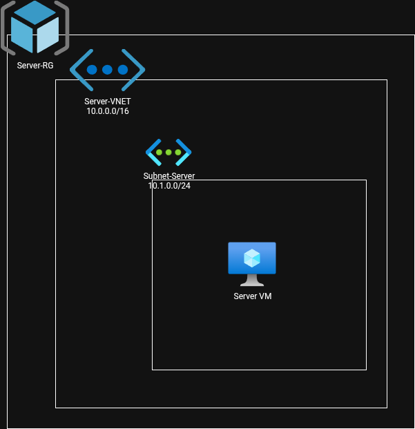

# Simple Server Environment

This project provides a minimal, fast server environment ready for immediate use. It is designed for quick setup and easy deployment, making it ideal for development, testing, or lightweight production workloads. Simply clone the repository, follow the setup instructions, and start your server in minutes.

## Features

- Lightweight and fast
- Easy configuration
- Ready-to-use out of the box

## Architecture Diagram Summary

The diagram illustrates the core components of the Simple Server Environment. It shows how the server interacts with clients, handles requests, and manages configuration. The architecture emphasizes simplicity, scalability, and ease of deployment, making it suitable for various development and testing scenarios.

## Getting Started

1. Clone this repository.
2. Follow the setup instructions in the documentation.
3. Start your server and begin development.

## License

This project is open source and available under the MIT License.
